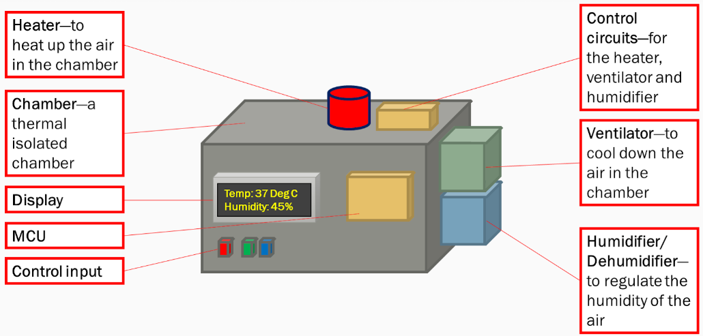

# A climate control chamber
## Overview
This climate control chamber lets you easily adjust the temperature and humidity to create the perfect environment for your needs. You can turn the system on or off and set the temperature and humidity using simple buttons. A display shows you the on/off status, the current temperature, and humidity levels. The onboard controller's real-time software enables precise monitoring and control of the climate around the clock.

Following are the main components and their features:
- **The heater and the ventilator**--Actively controlling the temperature inside the chamber within the range of 20-40 degree C with an error that is less than 1 degree C.
- **The Humidifier/dehumidifier**--Activelt controlling the humidity level inside the chamber within the range of 25-75 percent with an error that is less than 5 percent.
- **The chamber**--insulated box with a volume of ca. 15 liters.
- **Control input buttons**--Consists of physical buttons to get input from the user.
- **A Display**--Showing the status and the temperature/humidity information.
- **Control software**--Monitor and control the climate in real-time. Any given temperature/humidity setting can be reached within max. 2 minutes regardless of the initial condition.

## Implementation
The final prototype uses a 60 Watt DC heat coil as a heater and a 90X90mm 12 DC fan as a ventilator. An off the shelf humidifier/dehumidifier unit from TGGS is used. An LCD display and some pressed buttons are used to provide interface to the user. In additional, an AC to DC power supply is used to power the setting.

The hardware components are connected to and controlled by a single Arduino Mega2650 board. The source code 

[File Name](https://github.com/user/repository/blob/branch/path/to/file)
